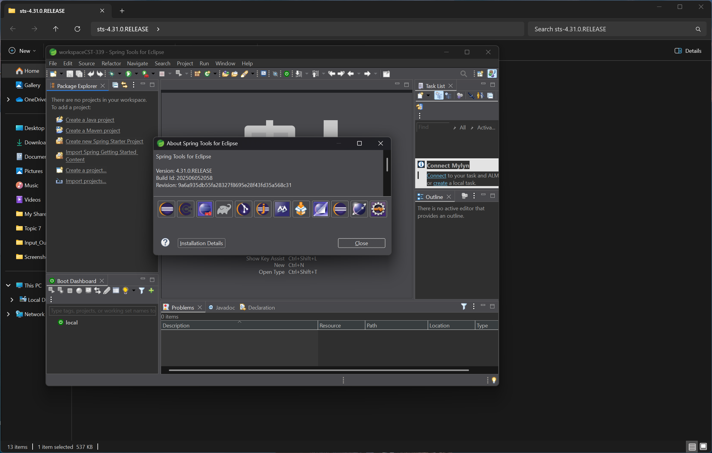
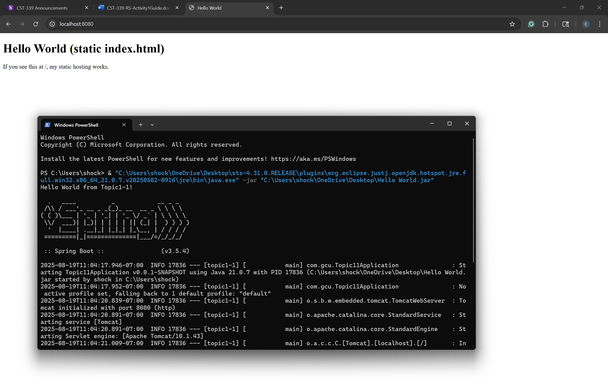

# Activity 1  
**CST-339 Programming in Java III**  
**Carlos Cortes**  
**2025**  

---

## Part 1: Tool Installation and Validation  

### Spring Tool Installation for Eclipse  

### Hello World  

### Whitelabel Error Page  

### Static index.html Hello World  

---

## Part 2: Learning Maven  

### Maven Build Success  

### Hello World Static Index  

