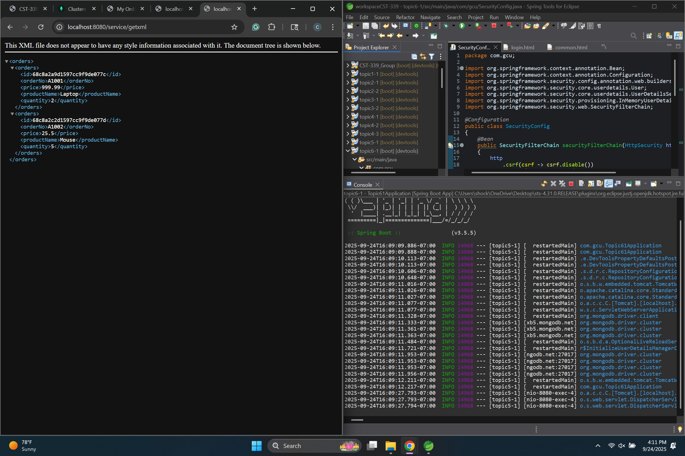

# Activity 6  
**CST-339 Programming in Java III**  
**Carlos Cortes**  
**2025**  

---

## Part 1: Securing a Web Application Using an In-Memory Datastore

### Orders Page Display

The first screenshot should display the Orders page after successfully logging in with the username and password test/test. This confirms that Spring Security is enforcing authentication and that the application can still retrieve and display orders from MongoDB.

### JSON REST API Output

The second screenshot should show the output from accessing http://localhost:8080/service/getjson. This demonstrates that the REST API is returning order data in JSON format and that the endpoint is working as expected.

### XML REST API Output

The third screenshot should show the output from accessing http://localhost:8080/service/getxml. This verifies that the REST API is also functioning correctly for XML responses and that both formats are available for use.

---

## Part 2: Securing a Web Application Using a Database

### Orders Page Display

The Orders Page screenshot shows the orders displayed after successful login, confirming that Spring Security authentication is working with MongoDB credentials.

### REST API JSON Response

The JSON screenshot confirms the /getjson endpoint returns data in JSON format for use by REST clients.

### REST API XML Response

The XML screenshot confirms the /getxml endpoint returns the same data in XML format, showing support for multiple data representations.

---

## Part 3: Securing REST APIs Using Basic HTTP Authentication

### GET JSON Good Credentials

Successfully returned the orders data in JSON format after logging in with valid Basic Auth credentials (testuser/password123).

### GET JSON Bad Credentials

Attempting to log in with an invalid password resulted in a 401 Unauthorized error, blocking access to the JSON response.

### GET XML Good Credentials

Successfully returned the orders data in XML format after logging in with valid Basic Auth credentials.

### GET XML Bad Credentials

Using an incorrect password on the XML endpoint also resulted in a 401 Unauthorized error, preventing access.

---

## Part 4: Securing REST APIs Using OAuth2 Authentication

### GitHub Login Screen

This screenshot shows the OAuth2 authentication redirect. When accessing the secured /service/test API, the browser is redirected to GitHub’s login page. This proves that the REST API is now protected and requires GitHub credentials for access.

### API Response After Login

This screenshot displays the successful response from the /service/test endpoint after authenticating with GitHub. The API prints a message like “Hello, <username>”, showing that the authenticated user’s GitHub identity is passed into the service and recognized.

---

### Conclusion
In Part 1, I successfully implemented Spring Security with an in-memory datastore to protect the web application. After logging in with the test credentials, I was able to access the Orders page and confirm that order data from MongoDB displayed correctly. I also verified that the REST API endpoints returned both JSON and XML outputs, demonstrating that the application’s security and functionality were properly configured.

In Part 2, I successfully demonstrated that the Orders page is accessible only after login and correctly displays order data from the database. I also verified that the REST API endpoints return order data in both JSON and XML formats, confirming the application supports multiple data representations and anonymous access for external clients.

In Part 3, Basic HTTP Authentication was applied to secure the REST API endpoints. The tests showed that valid credentials grant access to both JSON and XML responses, while invalid credentials return a 401 Unauthorized error. This confirms that the REST APIs are now properly secured with Basic Auth, ensuring that only authenticated users can access the data.

In Part 4, I successfully secured the REST API using OAuth2 with GitHub as the authentication provider. The /service/test endpoint required authentication, redirected to GitHub’s login page, and only allowed access after valid credentials were provided. This demonstrates the integration of an external OAuth2 provider into Spring Security, ensuring stronger security than Basic Auth.