# Activity 2  
**CST-339 Programming in Java III**  
**Carlos Cortes**  
**2025**  

---

## Part 1: Creating Models, Views, and Controllers Using Spring MVC

### /hello/test1
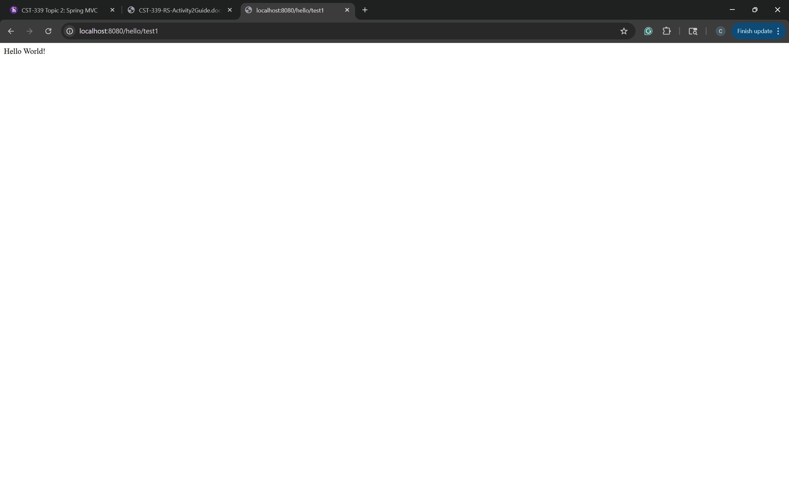
Shows the plain text response "Hello World!" returned directly from the controller with @ResponseBody.

### /hello/test2 
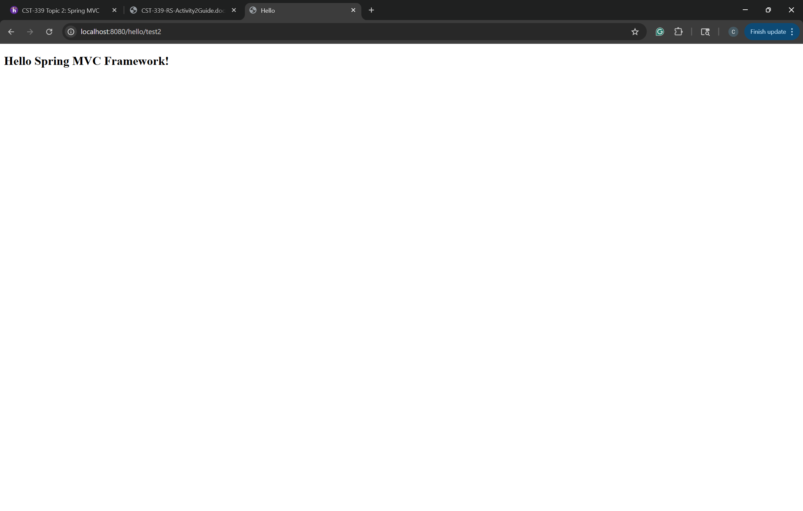
Displays the message "Hello Spring MVC Framework!" rendered inside hello.html using the Model.

### /hello/test3
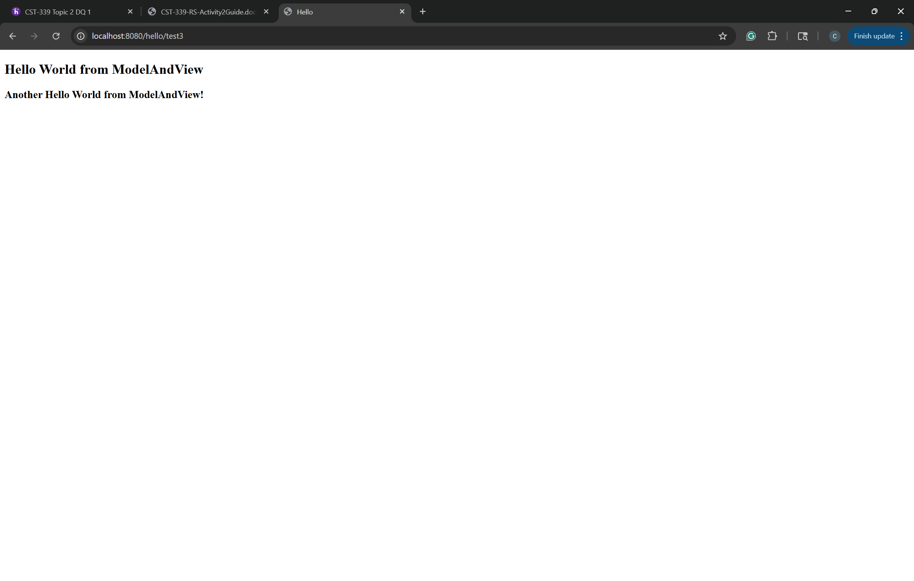
Renders hello.html with two messages: "Hello World from ModelAndView!" and "Another Hello World from ModelAndView!" (set using ModelAndView).

### /hello/test4
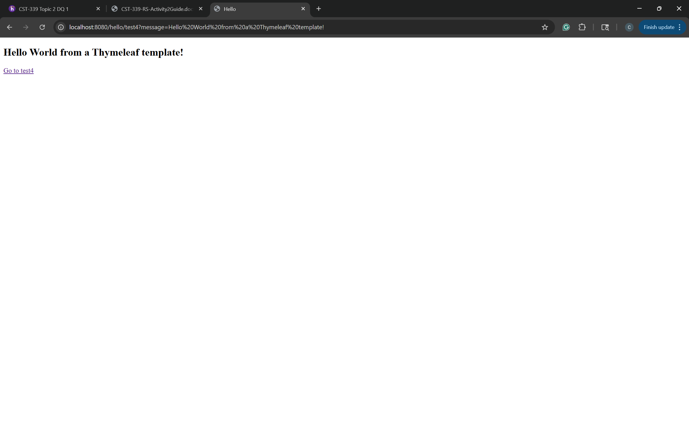
Shows hello.html displaying the message passed as an HTTP request parameter ("Hello World from a Thymeleaf template!") via the anchor tag. 

### Adding anchors to test cases
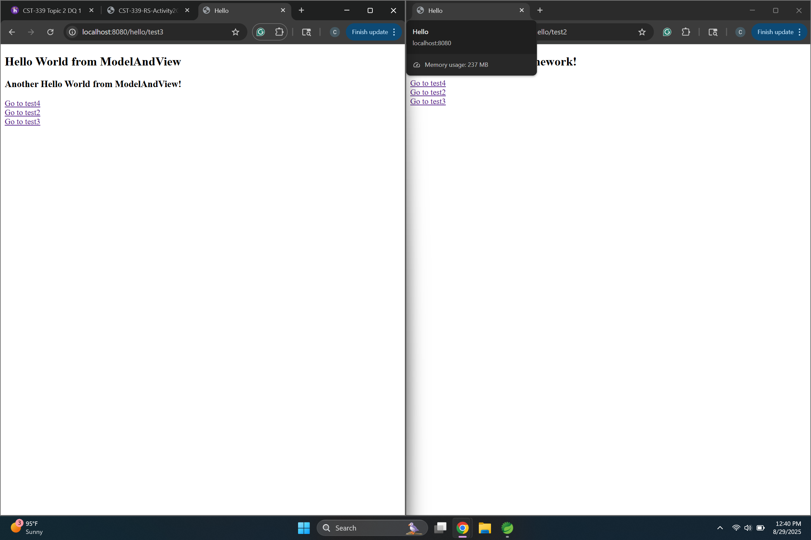
Showcases the anchors to the different test cases working properly

### Root URI (/)
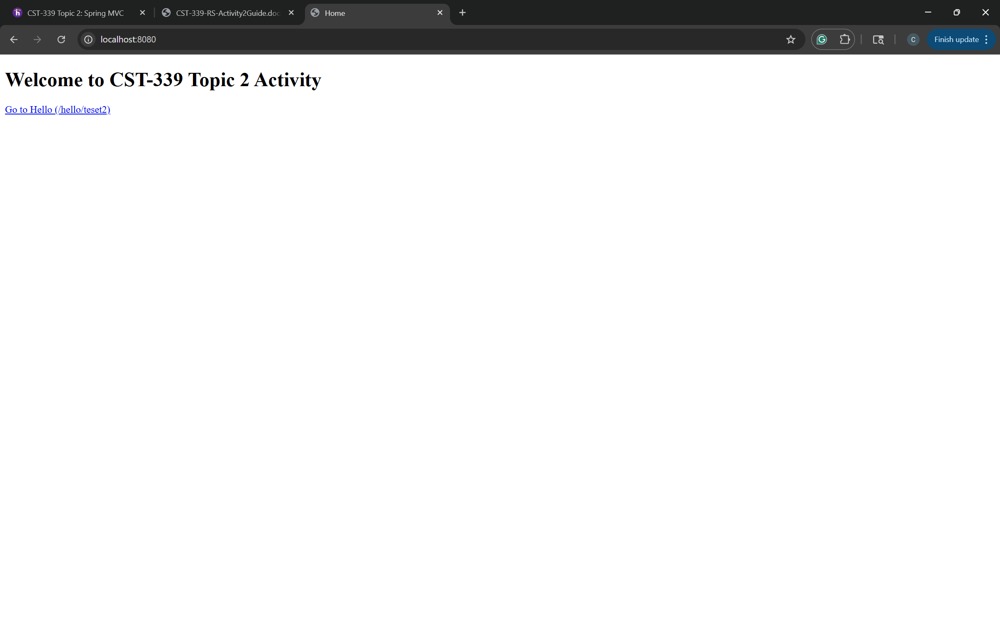
Loads home.html with the welcome message "Welcome to CST-339 Topic 2 Activity" and an anchoring tag linking to /hello/test2

---

## Part 2: Creating Forms with Data Validation Using Spring MVC 

### Login Form Page  
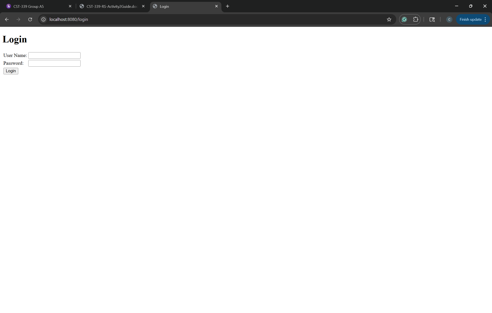
Shows the login.html form with username and password fields laid out in a table, and a submit button to log in.

### Orders Page 
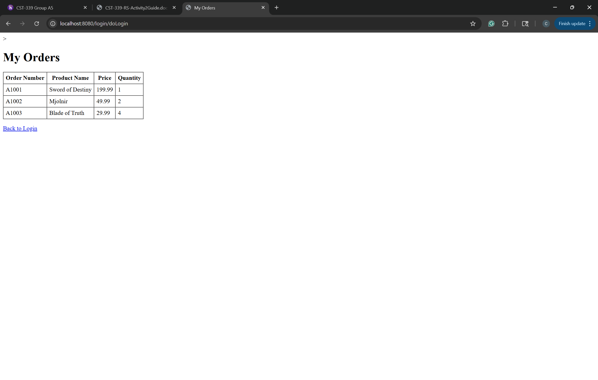
Displays the orders.html view after a successful login, with the title "My Orders" and a table listing defaulkt orders (order number, product name, price, and quantity.)

### Validation Errors
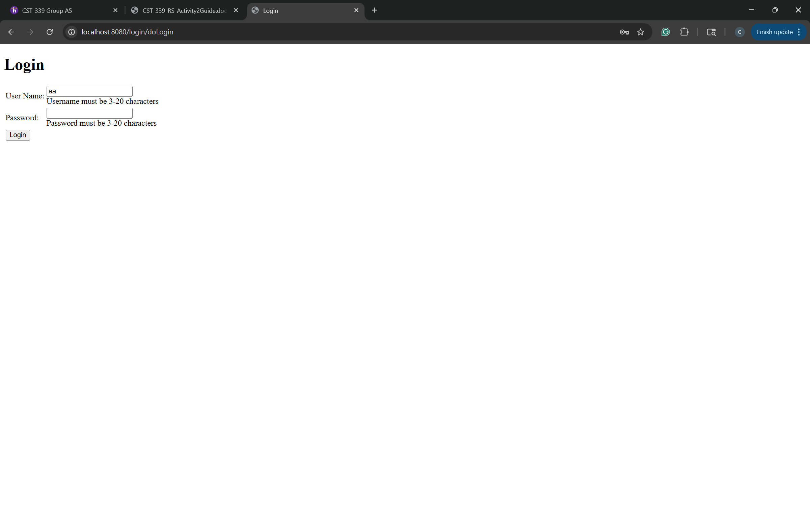
Shows the login form again with error messages under the fields when you try to submit with missing or invalid username/password/

---

## Part 3: Creating Layouts using Thymeleaf

### Login Page using Layouts
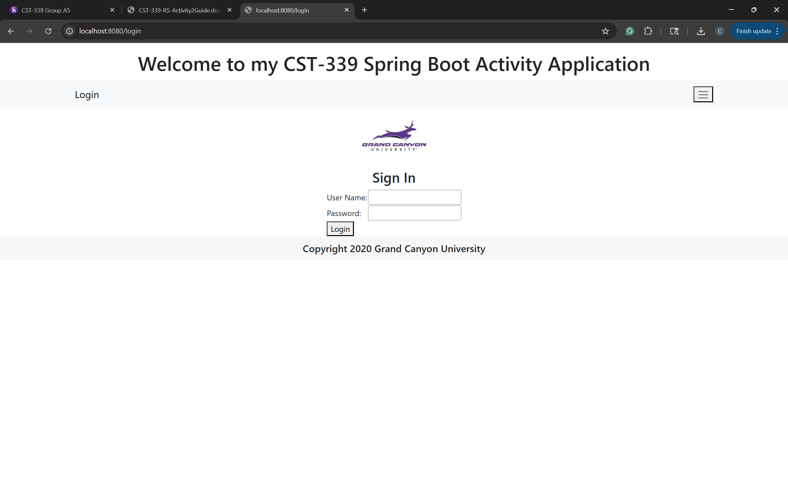
Shows the login form displayed inside the new Thymeleaf layout, with the common header (welcome text, navbar, page title, and GCU logo) and footer applied.

### Orders Page with Layouts
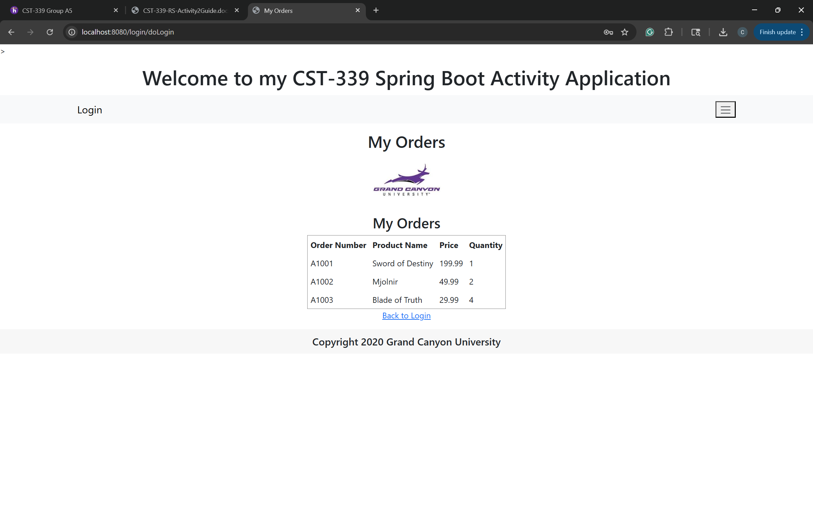
Displays the orders table inside the shared Thymeleaf layout, again with the header and footer fragments, demonstrating consistent styling across pages.

---

### Conclusion
This assignment demonstrated how to build a Spring Boot web application step by step using the MVC pattern with Thymeleaf. In Part 1, I created simple controllers, views, and model attributes to understand request mapping and dynamic content rendering. In Part 2, I learned how to create and process forms, add validation, and display data from model classes in a table format. Finally, in Part 3, I applied Thymeleaf layouts and fragments to create reusable headers and footers, giving the application a consistent look and feel across multiple pages. Overall, the activity provided a solid foundation in combining Spring Boot with Thymeleaf for building structured, maintainable web applications.

