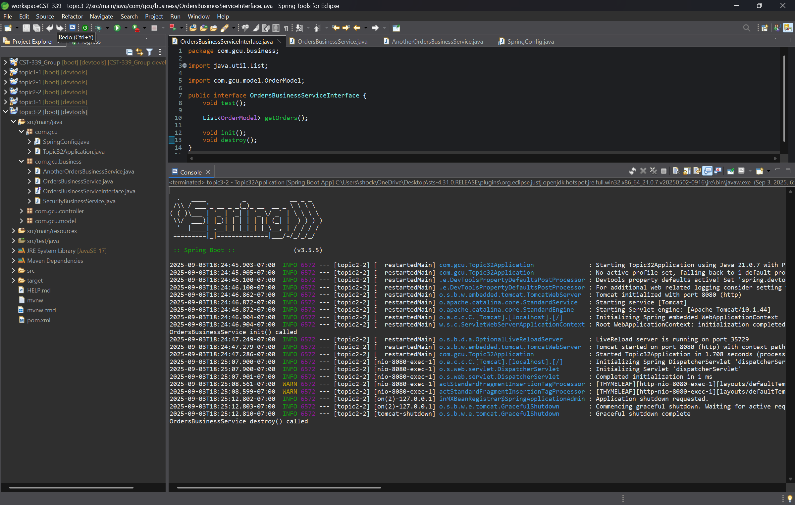

# Activity 3  
**CST-339 Programming in Java III**  
**Carlos Cortes**  
**2025**  

---

## Part 1: Creating Spring Beans Services Using Spring Core

### OrdersBusinessService

Shows the console printing “Hello from the OrdersBusinessService” after submitting the login form, proving the business service was injected and called successfully.

### AnotherOrdersBusinessService 

Shows the console printing “Hello from the AnotherOrdersBusinessService” after changing the Spring bean config, proving the alternate business service is now being used.

### SecurityBusinessService

Shows the console printing “Hello from the SecurityBusinessService” after form submission, confirming the security service was injected and its authenticate() method was executed.

### Orders Page View

Displays the Orders page in the browser listing order items (A1001–A1003) & (B2001-B2002). This proves that the orders are now being provided from the OrdersBusinessService.getOrders() method instead of being hardcoded in the controller.

---

## Part 2: Spring Bean Life Cycle and Scopes

### (Init & Destroy) Screenshot

The console showed init() being called when the application started and destroy() being called when the application was stopped. This demonstrates how Spring manages bean lifecycle methods during startup and shutdown.

### Prototype Scope Screenshot

Each time the login form was submitted, the console showed a new init() call because a new instance of the bean was created for every injection. This demonstrates that prototype scope provides a completely fresh bean for each request to the container.

### Request Scope Screenshot

The console showed init() being called once per HTTP request, and then destroy() immediately after the request completed. This confirms that in request scope, a new bean exists only for the lifecycle of a single HTTP request.

### Session Scope Screenshot

The console showed init() being called once when a session started in one browser, and no new calls when submitting multiple times within the same session. However, when a new browser session was opened, another init() call occurred because session scope creates one bean per user session.

### Singleton Scope Screenshot

The console showed only one init() call, even after multiple requests and different browsers were used. This confirms singleton scope creates and shares a single bean for the entire application lifecycle.

---

## Part 3: Creating REST Services Using Spring REST Controllers

### Login Page using Layouts

Shows the login form displayed inside the new Thymeleaf layout, with the common header (welcome text, navbar, page title, and GCU logo) and footer applied.

### Orders Page with Layouts

Displays the orders table inside the shared Thymeleaf layout, again with the header and footer fragments, demonstrating consistent styling across pages.

---

### Conclusion
In Part 1, I learned how to create and inject Spring Beans using interfaces, configuration classes, and dependency injection. I successfully implemented two business services and a security service, switched between different implementations, and moved order data from the controller into the business service. This demonstrated the power of loose coupling in Spring and showed how services can be reused and easily swapped without changing controller logic.

In Part 2, I explored how Spring manages bean lifecycles and scopes. I confirmed that init() and destroy() methods are automatically triggered during startup and shutdown, then observed how different scopes affect bean creation: Prototype created a new bean each time it was requested, Request created a new bean for each HTTP request, Session created one bean per user session, and Singleton reused the same bean across the entire application. This exercise demonstrated how scope selection directly impacts application behavior, resource usage, and performance.
