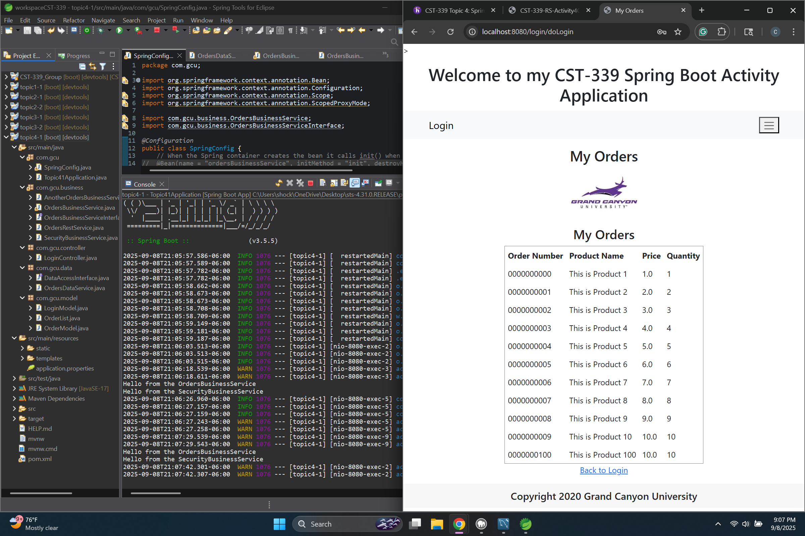
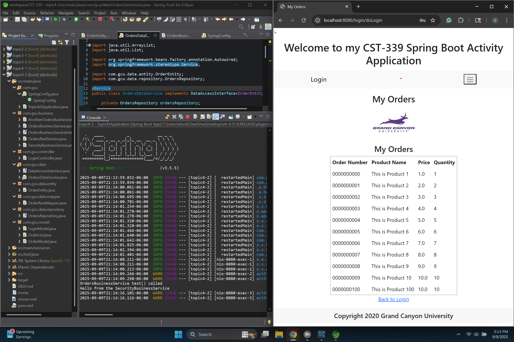
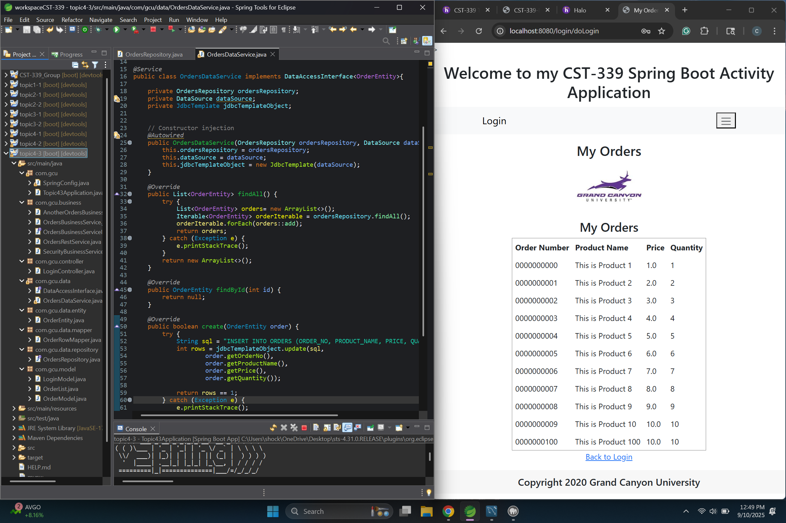

# Activity 4  
**CST-339 Programming in Java III**  
**Carlos Cortes**  
**2025**  

---

## Part 1: Creating Data Services Using Spring JDBC

### Creating Data Services Using Spring JDBC

This screenshot shows the Orders page successfully displaying data pulled directly from the MySQL ORDERS table. It confirms that the application is correctly using the OrdersDataService through the business layer to retrieve and render database records in the web view.

---

## Part 2: Creating Data Services Using Spring Data JDBC

### Orders Page Using Spring Data JDBC (Repository Pattern)

The screenshot shows the Orders page successfully retrieving and displaying data from the MySQL ORDERS table using Spring Data JDBC. This verifies that the application is correctly wired through the repository pattern and the OrdersDataService layer, ensuring that database entities are mapped and presented in the UI as domain models.

---

## Part 3: Creating Data Services Using Spriing Data JDBC Native Queries

### Orders Page Using Native SQL Queries in Spring Data JDBC

The screenshot of the Orders page demonstrates that the application can still successfully retrieve and display records from the MySQL ORDERS table after overriding the repository’s findAll() method with a custom native SQL query and replacing the default save() method with a manual JdbcTemplate implementation for inserts. This confirms that native SQL integration works as expected within the Spring Data JDBC framework.

---

### Conclusion
In Part 1, the project was configured to use Spring JDBC with the DAO design pattern to connect to a MySQL database. A custom OrdersDataService was created using the JdbcTemplate class to handle queries and map database results into OrderModel objects. While this approach required writing SQL statements manually and handling the result set explicitly, it provided valuable insight into how raw JDBC integrates with Spring Boot. The Orders page successfully displayed data from the ORDERS table, demonstrating that the application could retrieve and present persistent data through a custom DAO implementation.

In Part 2, the project was updated to use Spring Data JDBC with the Repository design pattern. Unlike the manual JDBC template implementation from Part 1, Spring Data JDBC simplifies persistence by automatically generating CRUD operations. The OrderEntity class mapped the ORDERS table, the OrdersRepository provided database access, and OrdersDataService connected this layer to the business service. The result is a cleaner, more maintainable approach that separates persistence concerns from the business logic while successfully displaying database records on the Orders page.

In Part 3, the project was extended to override Spring Data JDBC’s default behavior using native SQL queries. The OrdersRepository was updated with a @Query annotation to define a custom SELECT statement for retrieving all records, and the OrdersDataService was modified to perform INSERT operations using JdbcTemplate. This demonstrated how developers can take advantage of Spring Data JDBC’s abstraction while still retaining full control when fine-tuned SQL is required. The Orders page displaying data confirmed that the system remained fully functional with these changes.

