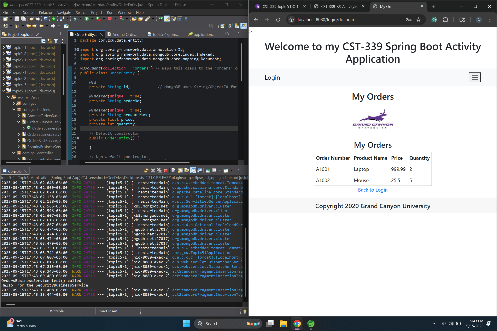
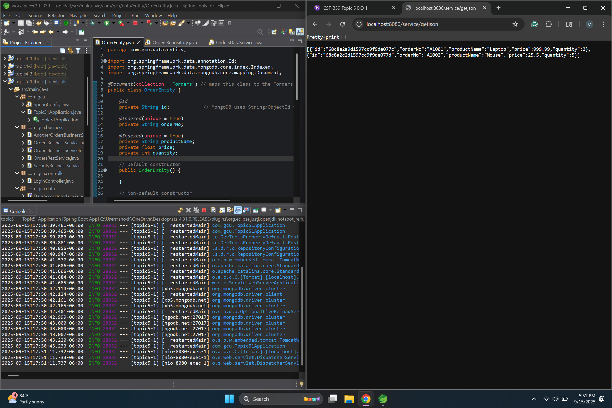
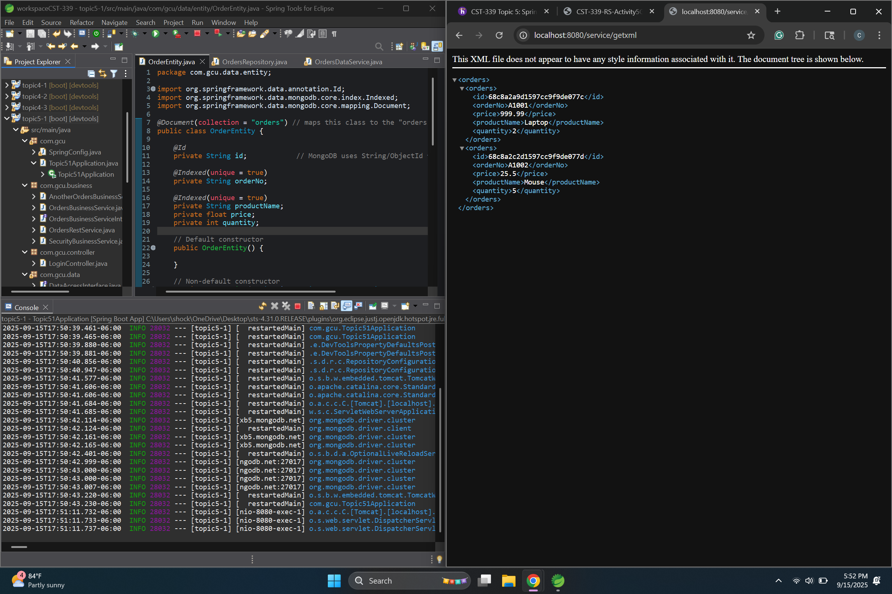
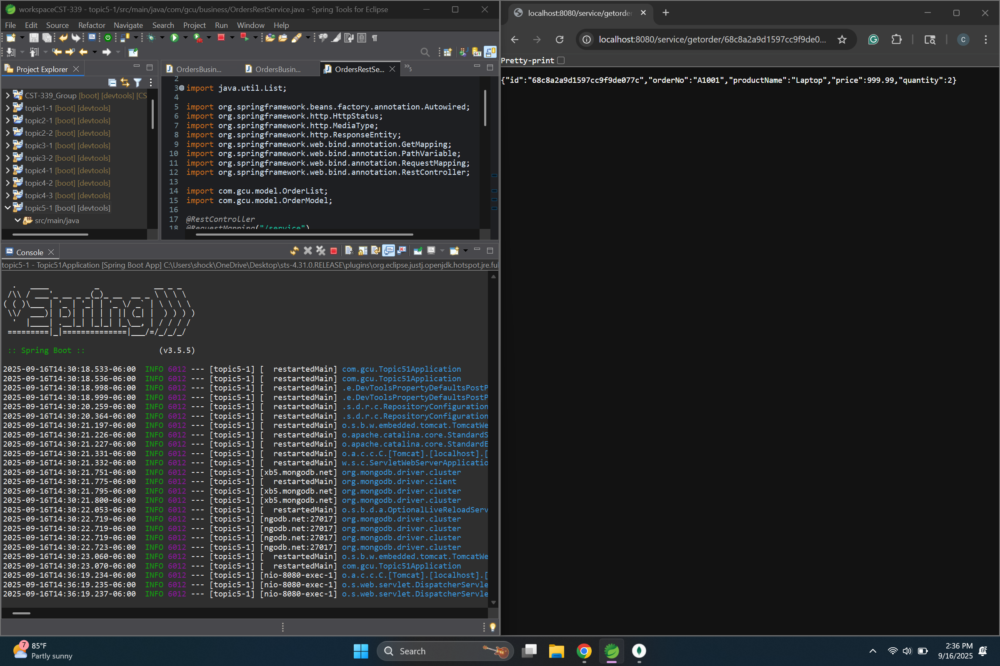
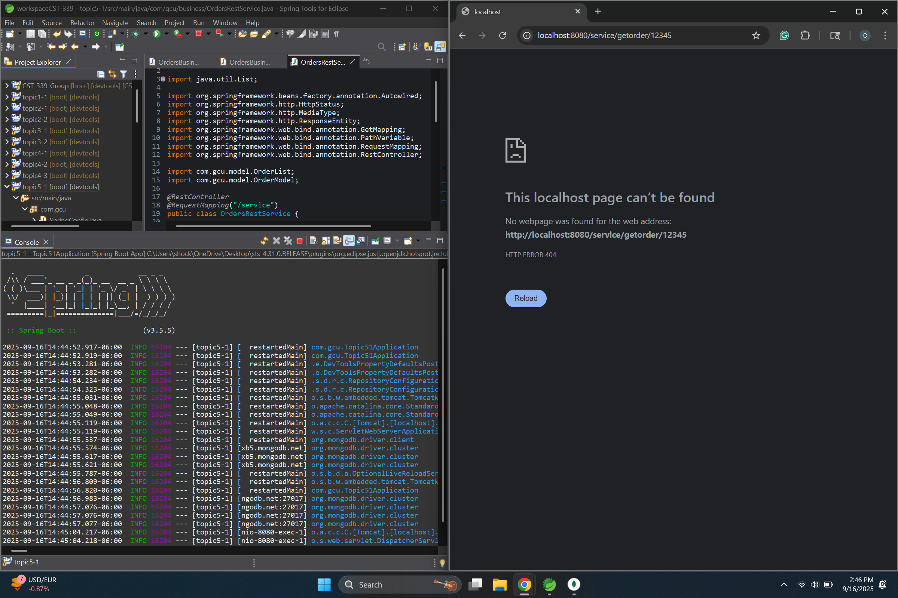

# Activity 5  
**CST-339 Programming in Java III**  
**Carlos Cortes**  
**2025**  

---

## Part 1: Creating Data Services Using Spring Data MongoDB

### Orders Page Display

Screenshot of the /orders page displaying the orders stored in MongoDB, confirming repository integration is working.

### JSON API Output

Screenshot of http://localhost:8080/service/getjson returning order data in JSON format, validating the REST endpoint

### XML API Output

Screenshot of http://localhost:8080/service/getxml returning order data in XML format, showing REST API supports multiple formats.

---

## Part 2: Adding New Queries in the MongoDB Repository

### Valid getOrder Request

Shows a successful response (200 OK) from the /service/getorder/{id} API. The correct order details are returned as JSON when using a valid MongoDB ID.

### Invalid getOrder Request

Demonstrates error handling with the /service/getorder/{id} API. When an invalid or non-existent ID is requested, the system responds with a 404 Not Found status, confirming proper error handling.

---

### Conclusion
In Part 1, of the assignment, the project was set up and configured to run with Spring Boot. A MongoDB Atlas cluster was connected to the application using Spring Data MongoDB. The OrderEntity class was updated with @Indexed annotations, and the OrdersRepository, OrdersDataService, and OrdersBusinessService were implemented. Testing confirmed that the /orders page properly displays data stored in MongoDB, and the REST API endpoints successfully return the order data in both JSON and XML formats.

In Part 2, I extended the functionality of the application by adding a new query to the MongoDB repository and exposing it through a REST API. The findById() method was updated to use a String identifier, aligning with MongoDB’s use of string-based IDs. This enabled the OrdersDataService and OrdersBusinessService to retrieve orders directly by their unique ID and return them as domain models. I also implemented the new /service/getorder/{id} REST endpoint, which allows users to fetch a single order using its ID while handling various response scenarios. Successful lookups return an HttpStatus.OK response with the order data, invalid IDs return HttpStatus.NOT_FOUND, and unexpected errors return HttpStatus.INTERNAL_SERVER_ERROR.